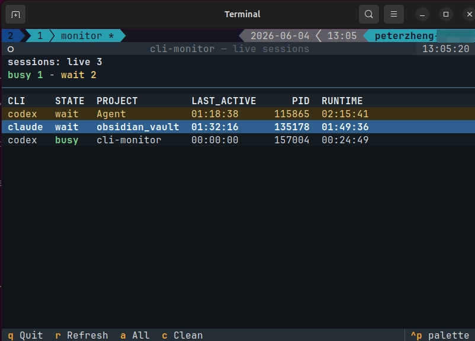

# cli-monitor

从一个终端监控多个 Claude/Codex 风格的 CLI 会话。

`cli-monitor` 是一个小巧的纯本地工具，适合同时跑多个 agent CLI 会话的人
使用。它会用 PTY 包装交互式 CLI 命令，记录轻量级会话元数据，并显示每个会
话当前是新建、忙碌、等待、已结束还是进程丢失。它本身不需要网络访问，也不
会调用外部服务；被包装的 CLI 仍可能按自身行为正常联网。

[English README](README.md)

## 为什么需要它

当不同项目里的 Codex 或 Claude Code 终端越开越多时，很容易忘记某个终端
里的任务已经完成，或者某个会话正在等待你确认、输入下一步指令。另一些会话
可能还在持续输出。没有一个统一视图时，你只能在多个终端之间来回切换，逐个
确认“现在到底哪个 agent 需要我处理”。

`cli-monitor` 就是为这个工作流准备的。你可以显式用
`cli-monitor run -- ...` 启动被监控会话。日常使用时，也可以运行
`./setup.sh` 注入 shell wrapper，这样你仍然像平时一样直接输入 `codex` 或
`claude`，监控会在背后自动生效，不需要改变默认使用习惯。需要实时监控时，
在另一个终端运行 `cli-monitor watch` 打开面板；只想快速看一眼状态时，可以
使用 `cli-monitor list`。它不是用来替代 Codex 或 Claude Code，而是帮助你在
多终端开发时更容易监督它们当前是否还在工作，还是已经在等待你的进一步操
作。

## 效果截图



## 功能特性

- 通过 `cli-monitor run -- ...` 包装任意交互式命令。
- 跟踪 Claude 和 Codex 会话，不保存完整终端 transcript。
- 显示会话状态、项目目录、最近回复估计时间、PID、最近可见输出时间和运行
  时长。
- 快速判断哪些会话正在等待你的下一步操作。
- 提供基于 Textual 的实时 TUI 面板，支持键盘操作和自动刷新。
- 在安装窗口辅助工具后，可在 Linux/X11 本地桌面聚焦选中的终端窗口。
- 如果会话从 tmux 内启动，可恢复记录的 tmux window 和 pane。
- 完全在本机运行，不依赖任何网络服务。
- 会话文件保存在本机 XDG state 目录下。

## 支持状态

`cli-monitor` 目前只支持 Linux，并且只在 Ubuntu 上测试过。其他 Unix-like
系统的基础 PTY 包装可能可用，但目前不作为已支持环境。

Claude Code 和 OpenAI Codex CLI 是目前唯一明确写入文档并经过重点验证的目
标 CLI。由于 `cli-monitor` 通过 PTY 包装命令，其他交互式 CLI 也可能可
用，但暂不作为已支持目标。

建议使用 `setup.sh` 完成本地安装。它会安装本包，并可在确认后安装会话聚焦
所需的桌面辅助依赖；也可以在确认后写入 shell function，让 `codex` 和
`claude` 自动通过 `cli-monitor` 启动。

可靠的窗口跳转依赖从 `tmux` 内启动被监控会话。没有 tmux 时，
`cli-monitor` 仍会尝试通过 X11 辅助工具聚焦匹配的终端窗口，但无法可靠恢
复到准确的工作 window 或 pane。

## 环境要求

- Python 3.10+
- Linux
- `textual`，会通过 `pyproject.toml` 自动安装，用于 `watch` TUI

Ubuntu/Debian 上 `setup.sh` 会询问是否安装的桌面聚焦辅助工具：

- `xdotool`
- `x11-utils` / `xprop`
- `tmux`，可靠跳转到目标 window/pane 需要它

窗口聚焦功能面向本地桌面环境。它可以在支持的 Linux/X11 桌面上拉起本地终
端窗口，但如果 `cli-monitor` 运行在远程 SSH 机器上，它不能直接聚焦你笔记
本上的本地终端，除非另行实现本地 helper。

## 安装

Ubuntu/Debian 上推荐使用：

```bash
./setup.sh
```

交互式安装时，脚本会在修改 shell rc 文件前先询问。Linux 下默认目标是
`~/.bashrc`。如果你同意写入 wrapper，之后直接运行 `codex` 或 `claude` 就会
自动被 `cli-monitor` 监控，不需要每次手动输入
`cli-monitor run -- ...`。

手动在本仓库目录下安装为 editable 包：

```bash
python3 -m pip install -e .
```

如果系统 Python 禁止直接安装用户包，请使用 virtualenv 或 `pipx`。

如果手动安装且需要会话聚焦，请自行安装 `xdotool`、`x11-utils` 和 `tmux`。

## 快速开始

如果安装时启用了 shell wrapper，可以直接启动常用 CLI：

```bash
codex
claude
```

没有启用 shell wrapper 时，可以显式启动被监控会话：

启动一个被监控的 Codex 会话：

```bash
cli-monitor run -- codex
```

启动一个被监控的 Claude 会话：

```bash
cli-monitor run -- claude
```

`--` 之后的参数都会传给被包装的 CLI：

```bash
cli-monitor run -- claude --dangerously-skip-permissions
```

在另一个终端查看当前活跃会话：

```bash
cli-monitor list
```

打开实时监控面板：

```bash
cli-monitor watch
```

## TUI 操作

在 `cli-monitor watch` 中：

| 按键 | 操作 |
| --- | --- |
| `q` / `Esc` | 退出 |
| `r` | 立即刷新 |
| `a` | 切换“仅活跃会话”和“全部会话” |
| `c` | 确认后清理 done/gone 会话文件 |
| `d` | 删除选中记录；仍在运行的进程需要确认 |
| `Enter` / `Space` | 聚焦选中的 live 会话 |

双击某一行也会尝试聚焦对应会话。

## 会话状态

`cli-monitor` 会区分可见屏幕输出和提交/控制输入，例如 Enter、Ctrl-C、
Ctrl-D。默认状态判断使用 5 秒输出窗口：

| 状态 | 含义 |
| --- | --- |
| `new` | 被包装命令已经启动，但还没有记录到提交/控制输入。 |
| `busy` | 已记录提交/控制输入，并且最近有可见输出。 |
| `wait` | 已记录提交/控制输入，但至少一个 active 窗口内没有可见输出。 |
| `done` | 被包装命令已经退出。 |
| `gone` | 记录的进程已经不存在。 |

修改 active 窗口：

```bash
cli-monitor watch --active-after 10
cli-monitor list --active-after 10
```

修改 TUI 刷新间隔：

```bash
cli-monitor watch --interval 0.5
```

## 命令

```bash
cli-monitor run -- <command> [args...]
cli-monitor list [--all] [--active-after SECONDS]
cli-monitor watch [--all] [--active-after SECONDS] [--interval SECONDS]
cli-monitor prune
```

`list` 和 `watch` 默认隐藏 `done` 和 `gone` 会话。加上 `--all` 可以显示全部
会话。

`prune` 会删除 `done` 和 `gone` 会话对应的 JSON 文件：

```bash
cli-monitor prune
```

## Shell 别名

日常使用时，建议用 shell function 包装你的 agent CLI。`setup.sh` 在发现
`PATH` 中存在 `codex` 或 `claude` 时，可以在确认后自动写入这些 function：

```bash
codex() {
  cli-monitor run -- /path/to/codex "$@"
}

claude() {
  cli-monitor run -- /path/to/claude "$@"
}
```

如果 shell 可能把 function 递归解析到自身，请使用真实二进制文件的绝对路
径。

不要在这些 function 内部 `cd`，除非你希望所有会话都显示同一个项目目录。
`PROJECT` 是被包装命令启动时所在目录的 basename。

## 存储数据

会话文件保存在：

```text
$XDG_STATE_HOME/cli-monitor/sessions/
```

如果没有设置 `XDG_STATE_HOME`，默认路径为：

```text
~/.local/state/cli-monitor/sessions/
```

会话文件包含命令参数、工作目录、PID、时间戳、终端/窗口标识、tmux 标识和
退出码等元数据。它们不是完整命令 transcript 的存储位置，`cli-monitor` 也
不会把这些数据发送到任何地方。

如果在 TUI 中删除仍在运行的会话记录，`cli-monitor` 会在
`$XDG_STATE_HOME/cli-monitor/deleted-sessions/` 下写入隐藏标记，避免
wrapper 后续写回状态时让记录重新出现。对应会话变成 done 或 gone 后，
`cli-monitor prune` 会清理这些隐藏标记。

## 开发

安装 editable 包：

```bash
python3 -m pip install -e .
```

运行测试：

```bash
python3 -m pytest
```

不安装 console script 时，也可以通过模块入口运行：

```bash
python3 -m cli_monitor.cli list
python3 -m cli_monitor.cli watch
```

## 已知限制

- 只有通过 `cli-monitor run -- ...` 启动的会话会被跟踪，包括 `setup.sh`
  安装的 shell wrapper。
- 目前只支持 Linux，并且只在 Ubuntu 上测试过。
- 窗口聚焦依赖本地桌面环境、`xdotool`/`xprop`，可靠恢复目标位置还依赖
  tmux。
- 聚焦功能在 Linux/X11 上最稳定；Wayland 尚未验证。
- 远程 SSH 会话不能直接聚焦你的本地终端窗口。

## 许可证

MIT License。详见 [LICENSE](LICENSE)。
